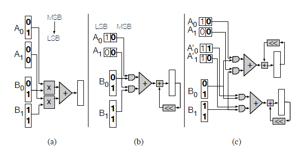

# Stripes: Bit-Serial Deep Neural Network Computing

* They have quantitatively analyzed computing throughput and required memory bandwidth of any potential solution of a CNN design on an FPGA platform using roofline analysis.

* Figure 1a shows a simplified inner product compute unit (IP) processing vectors A = (1; 0) (neurons) and B = (1; 3) (synapses).
** inner product of A and B = (1*1, 0*3)=(1, 0)
* Figure 1b shows a Serial Inner Product unit (SIP) where A’s values have been transposed and are now processed bit-serially over two cycles (this example assumes unsigned numbers for simplicity).
* Figure 1c Bit-serial computation for A and A’ matching (a)’s throughput.

## Figure 1 a b and c

