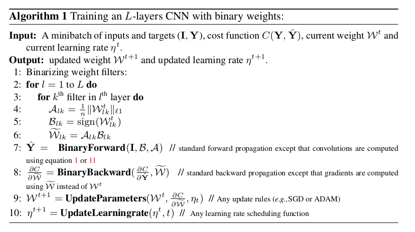

# Binary Connect Summary

1. Useful idea is to use a data set and write a normalization engine
in VHDL to 1 and -1.
2. Forward Propagation via VHDL
3. Backpropagation via VHDL

## Training Binary Network

Binarize the weights only during forward and backward pass.
Weight updating functions can differ with constant values to
shift update valeus.

