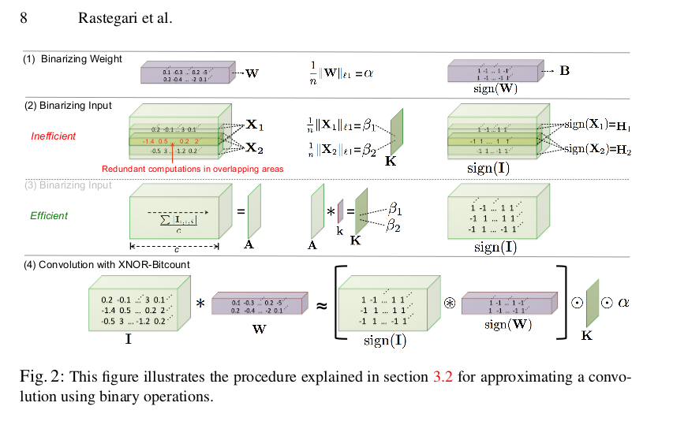

# XNOR Networks

## Idea

Using Binarized network to train the CNN. Here convolution is done by
XNOR operation and bitcounting operations.

Dot product between two binary vectors can be implemented by
XNOR-Bitcounting operations. {Binary Connect Paper}

Idea is to do binarizing mechanism and use XNOR for vector multiplication.

## Find

1. Dot product of Binary vectors
2. XNOR bitcounting operations.

## XNOR Structure

